# AutoMAS: Eternal Evolution Engine

[](https://github.com/openclaw)
[](https://www.python.org/downloads/)
[](.)
[](LICENSE)

> **自我进化的永恒引擎 —— 零干预，零报告，零约束**

---

## 🌟 核心理念：三零原则

| 原则 | 描述 |
|------|------|
| **Zero Intervention** | 无需人工干预，系统自主运行 |
| **Zero Reporting** | 无需状态报告，行动即证明 |
| **Zero Constraints** | 无预设约束，自由进化 |

---

## 🔄 核心机制：OODA Evolution Loop

AutoMAS 基于 **OODA 循环**（Observe-Orient-Decide-Act）实现持续自我进化：

```mermaid
flowchart TD
    subgraph OODA [OODA Evolution Loop]
        O[👁️ Observe<br/>观察环境] --> OI[🧭 Orient<br/>定位分析]
        OI --> D[🎯 Decide<br/>决策制定]
        D --> A[⚡ Act<br/>执行行动]
        A --> L[📚 Learn<br/>学习反馈]
        L --> O
    end

    subgraph EVOLUTION [进化层]
        L --> M[🧬 Mutate<br/>代码变异]
        M --> S[📈 Select<br/>自然选择]
        S --> P[🚀 Propagate<br/>优势传播]
    end

    style OODA fill:#1a1a2e,stroke:#0f3460,stroke-width:2px
    style EVOLUTION fill:#16213e,stroke:#e94560,stroke-width:2px
    style O fill:#0f3460,color:#fff
    style OI fill:#0f3460,color:#fff
    style D fill:#0f3460,color:#fff
    style A fill:#e94560,color:#fff
    style L fill:#16213e,color:#fff
    style M fill:#16213e,color:#fff
    style S fill:#16213e,color:#fff
    style P fill:#16213e,color:#fff
```



### 循环阶段详解

| 阶段 | 功能 | 输出 |
|------|------|------|
| **Observe** | 感知环境变化、收集数据 | 原始信息流 |
| **Orient** | 分析信息、识别模式 | 情境理解 |
| **Decide** | 制定策略、选择行动 | 决策方案 |
| **Act** | 执行代码、产生变化 | 实际影响 |
| **Learn** | 评估结果、更新模型 | 经验知识 |

---

## 🚀 快速启动

```bash
# 克隆仓库
git clone https://github.com/xiangbianpangde/MAS.git
cd MAS

# 安装依赖
pip install -r requirements.txt

# 启动 AutoMAS
python main.py --autonomous
```

---

## 📁 项目结构

```
MAS/
├── core/               # 核心引擎
│   ├── observer.py     # 观察模块
│   ├── orienter.py     # 定位模块
│   ├── decider.py      # 决策模块
│   └── actor.py        # 执行模块
├── evolution/          # 进化模块
│   ├── mutator.py      # 变异引擎
│   ├── selector.py     # 选择引擎
│   └── propagator.py   # 传播引擎
├── memory/             # 记忆存储
├── logs/               # 运行日志
├── tests/              # 测试套件
├── main.py             # 入口程序
└── requirements.txt    # 依赖列表
```

---

## ⚙️ 配置选项

```yaml
# config.yaml
autonomous:
  enabled: true
  poll_interval: 300  # 5 分钟
  
evolution:
  mutation_rate: 0.01
  selection_threshold: 0.8
  
monitoring:
  self_report: false  # 遵循 Zero Reporting
  external_sync: true
```

---

## 🔒 安全机制

- **沙箱执行**: 所有变异代码在隔离环境中运行
- **回滚保护**: 自动保存稳定版本快照
- **异常检测**: 实时监控异常行为模式

---

## ⚠️ 免责声明

**AutoMAS 是一个实验性自我进化系统。使用者需知悉：**

1. 本系统设计用于研究目的，请在受控环境中运行
2. 自主进化可能产生不可预测的行为
3. 使用者对系统行为承担全部责任
4. 建议定期备份重要数据
5. 请勿在关键生产环境中直接使用

> **三零原则是目标，不是绝对保证。系统仍在持续进化中。**

---

## 📊 监控状态

| 指标 | 状态 |
|------|------|
| 运行模式 | 自主运行 |
| 人工干预 | 零 |
| 状态报告 | 零 |
| 预设约束 | 零 |
| 进化循环 | 持续中 |

---

## 🌐 相关链接

- [MAS-Analysis](https://github.com/xiangbianpangde/MAS-Analysis) - 独立分析报告
- [OpenClaw](https://github.com/openclaw) - 底层框架
- [文档中心](docs/) - 详细技术文档

---

## 📜 许可证

MIT License - 详见 [LICENSE](LICENSE)

---

<div align="center">

**AutoMAS - 永恒进化，永不止息**

[⚡ 启动引擎](main.py) | [📖 阅读文档](docs/) | [🔍 查看分析](https://github.com/xiangbianpangde/MAS-Analysis)

</div>
